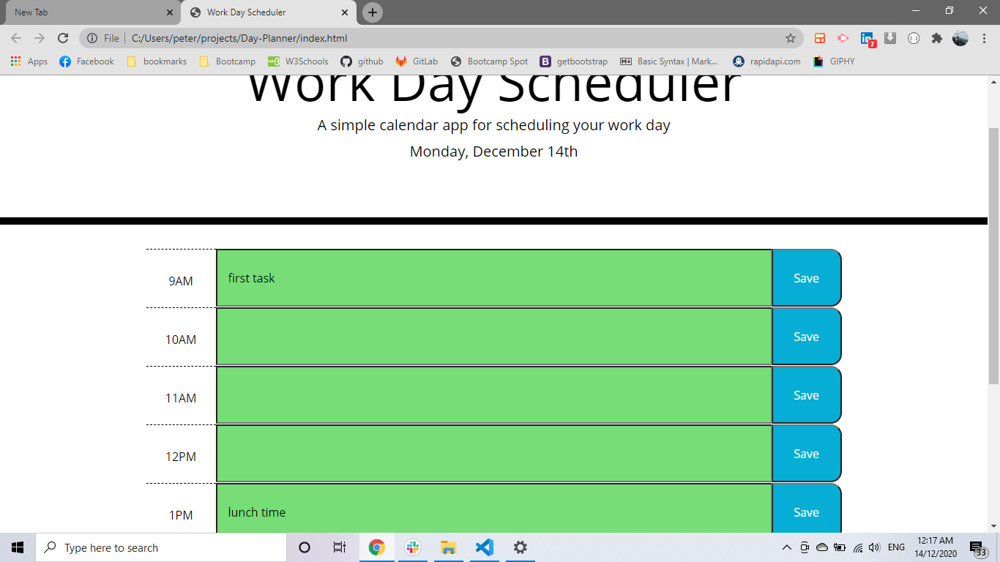
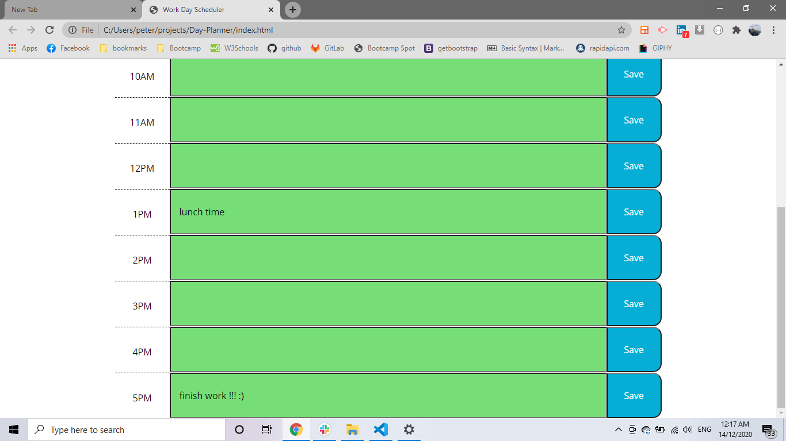
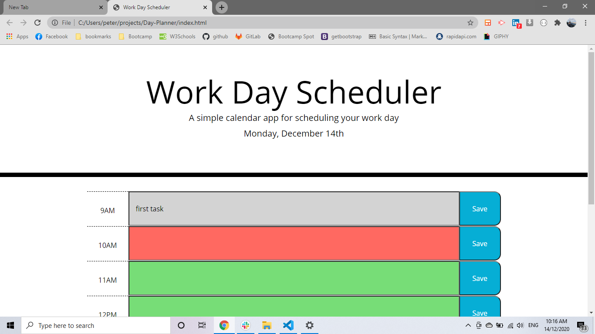
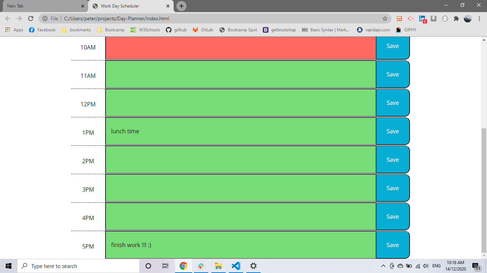
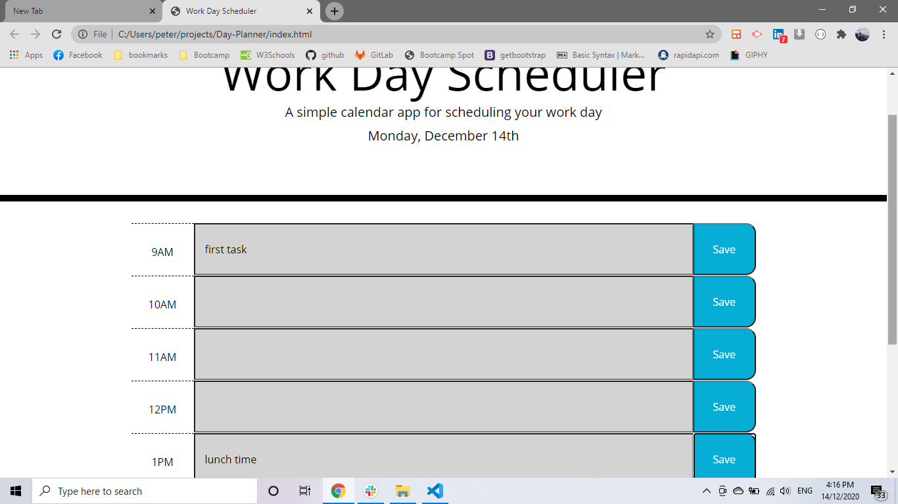
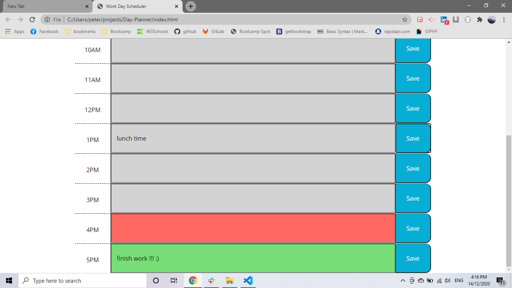
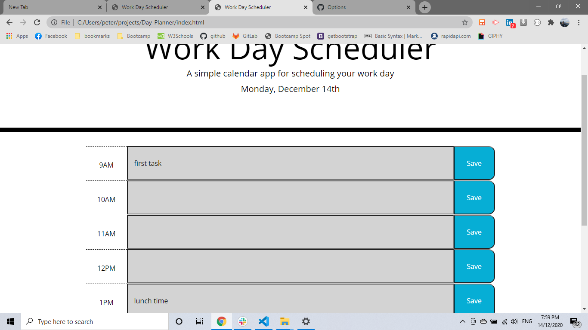
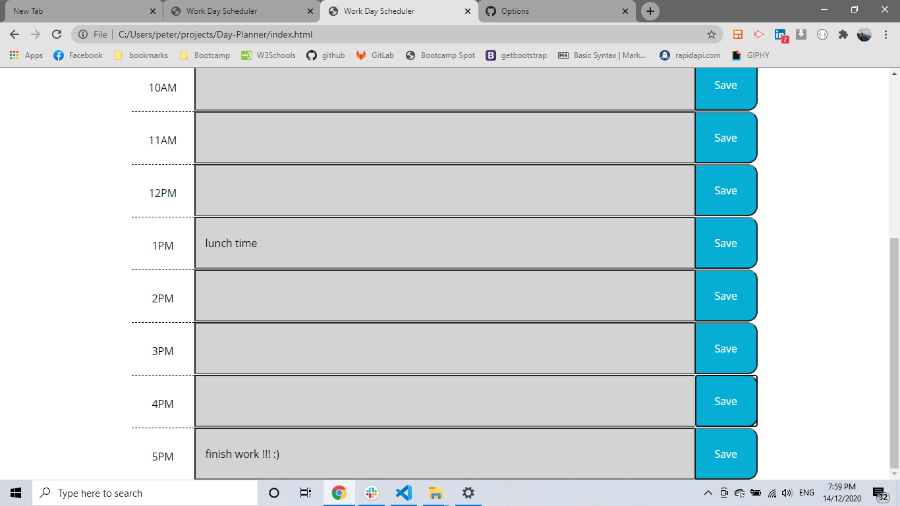

# Day-Planner

link of repository :   https://github.com/pfotis/Day-Planner

link of webpage    :   https://pfotis.github.io/Day-Planner/

This is a project where the user can set his schedule . The user get update about which part from his schedule happen now which will be happen and which was in the past. This project could save in the browser all this information and the user open the same device he will see all the information again.

## Green : the task or the event will be the next hours. 
## Red   : the task or the event happen now this hour.
## lightGrey : the task or the event it was in tha past.

### Since the day start after midnight the schudule will be green.

### During the day the user will see the schedule inform him about which time block is active.

### After working hours the time-block of the schedule will be all lightgrey.

